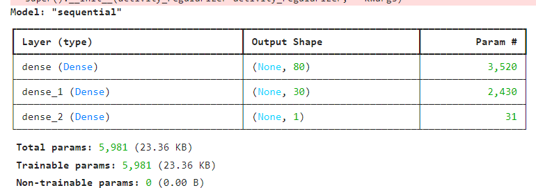
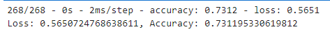
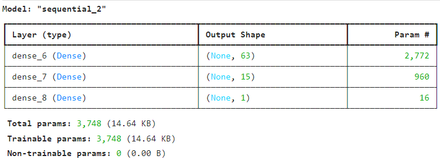
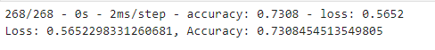
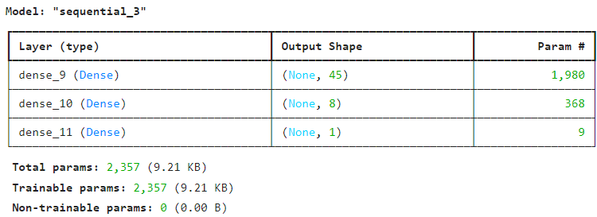
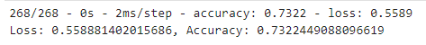

Overview of the analysis: Explain the purpose of this analysis.
The nonprofit foundation Alphabet Soup wants a tool that can help it select the applicants for funding with the best chance of success in their ventures

Firstly we looked at the data and dropped any irrelevant information such as EIN() and Name as they were not targets nor features , the target was the Is Successful column while the rest were used as features for the model. 
The data was then spilt for training and testing sets. 
After spillting i could thenCompile, train and evaluate the model using the Sequential Model.

There were three layers to this model, and i had tried 3 attemps to get the target higher than my first attemp which was 73.12% accuracy and .56.51% loss 

 Attempt 1 
 - Attempt 1 results

 Attempt 2
 Attempt 2 Results 

 Attempt 3 
 Attempt 3 Results

 
 I used the same Model to do an Attempt 2 and Attempt 3 - 
 For Attemp 2 - I changed the layer united to 63 for the imput layer, 15 on the hidden layer and 1 on the output layer to see if that would change the accuracy however it only slightly changed ( 73.08 % accuracy and 56.52% loss )
 Attempt 3 - i changed the layer unit's to 45 for the input layer, 8 on the hidden layer and 1 on the output layer this changed the accuracy to 73.22 % and 55.89% loss 

 It doesn't seem changing the units is effecting the accuracy or the loss %

